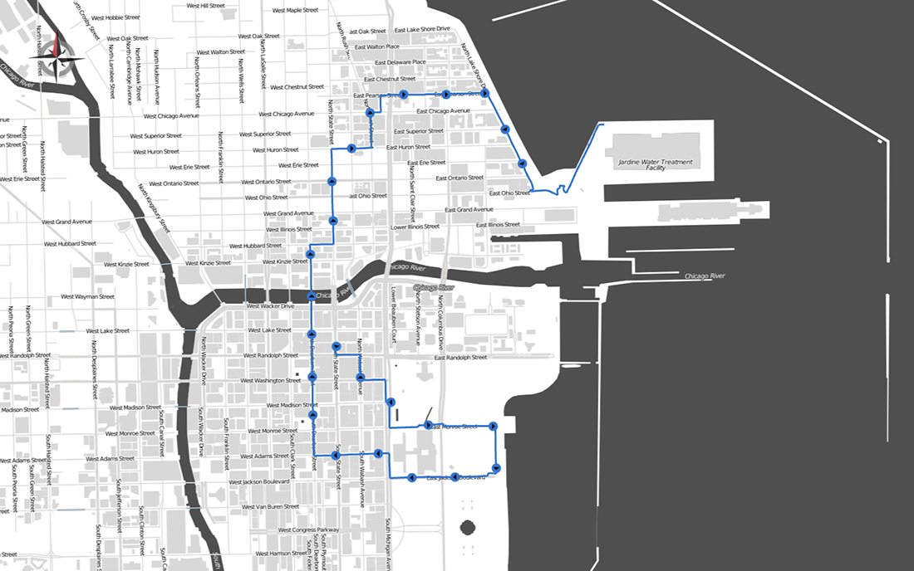
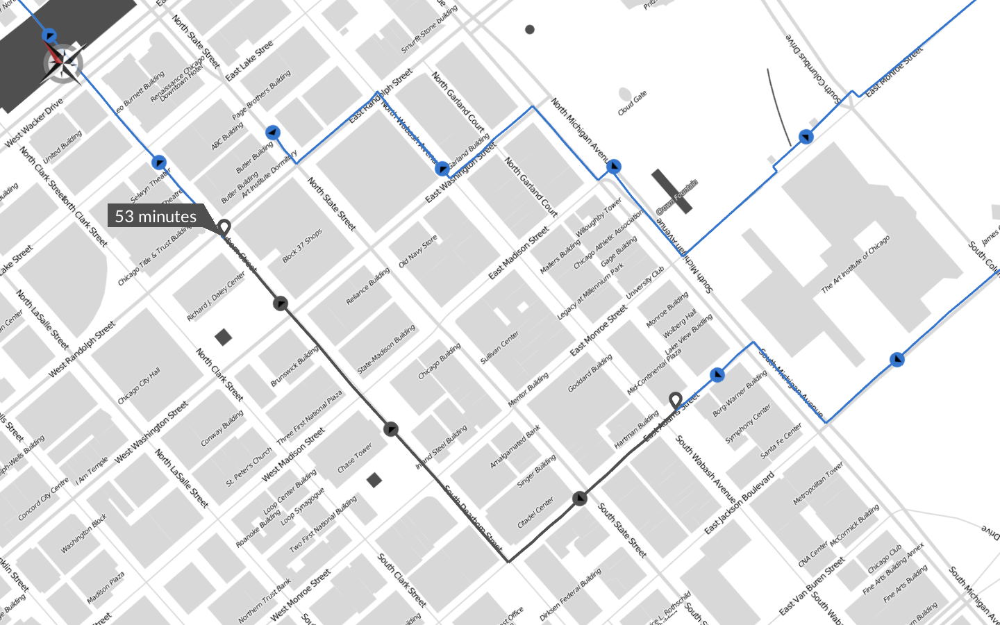
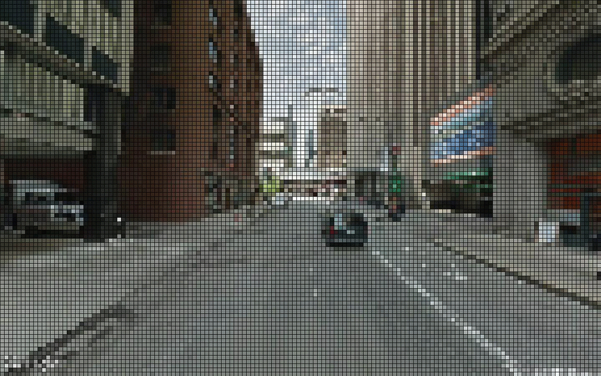

#This is a Tracking Device

This GitHub repo holds all of the source files for the interactive map software created for the forthcoming *This is a Tracking Device*
project:

>Small metal cubes with the text 'this is a tracking device' will be placed around public downtown Chicago.
>Inside each sealed box is a tracking device with a lifespan of 7 days. The data from the location of each box is logged every 3 minutes and eventually
>visualized in the gallery space using the above software. Public interaction with the Tracker Cubes is entirely voluntary although
>no information is provided on the cubes themselves.

>This work deals with themes of public interaction, temptation, and mystery from the point of the anonymous strangers who
>move the cubes. The themes alter towards surveillance, power, as well as data study and analysis from the point of the
>artist and viewers.

This software was created using the excellent [Unfolding Maps](http://unfoldingmaps.org/) librabry for Processing. It is intended to be a
suplementary approach by which to explore the data collected from *This is a Tracking Device*. Map features include:

+ Draw interactive routes using GPX data*
+ View timestamps of gps trackpoints by hovering over the route
+ View time elapsed between two selected trackpoints by clicking two locations along the route
+ View direction of travel through simple arrow visualizations on waypoints
+ Access pixelated Google Street View image of locations by clicking circular waypoints
+ Use intuitive controls for rotatation, panning, and zooming of the map 

\*maps auto-pans to view locations represented in the .gpx data file. This feature does not yet support auto-zooming and some values may need to
bee hard coded into each sketch depending on the number of trackpoints in the .gpx file to avoid recursion errors.